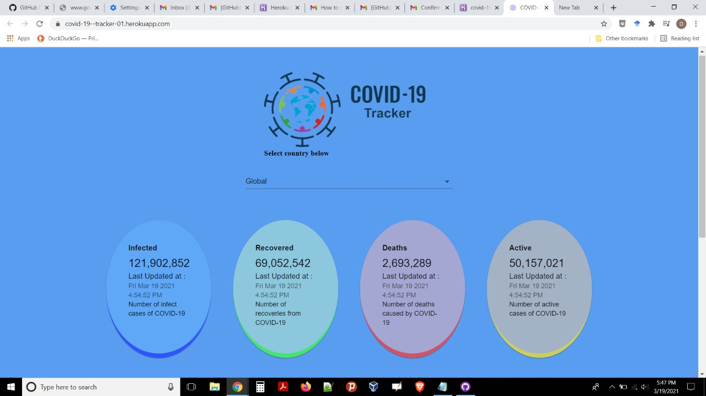
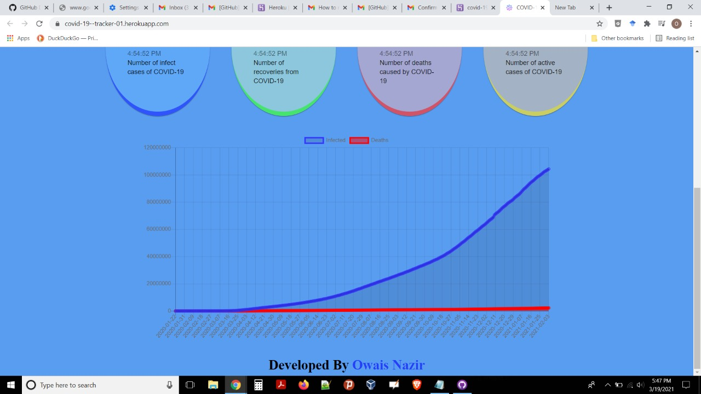

## Introduction
This is the covid map tracker project in which we have taking the live data from the covid tracking api and data updated from the given api.
here the we have used a slider according to which the different cases count density increase with the count of tha covid cases in the worlds map for the different countries.
and we can alone select the active , dead and infected count cases using the select toggle button.
we have used the different endpoints of the api to show the data on the our webapp.
I have built this covid19 tracker using the reactjs.
## 🛠️ Built with

- [React](https://es.reactjs.org/) - Front-End JavaScript library
- [Material UI](https://material-ui.com/) - React UI Framework

## Installation

To setup the app for development on your local machine, please follow the instructions below:

1. Clone the repo to your machine

   ```bash
   git clone https://github.com/owaisNazir22/covid-live-tracker.git
   cd covid-19-tracker
   ```

2. Install packages

   If you use `npm`

   ```bash
   npm install
   ```

3. Run the development server

   If you use `npm`

   ```bash
   npm start
   ```
4. Visit <http://localhost:3000>

## [Live Demo](https://covid-19--tracker-01.herokuapp.com/)

## Screenshots of the live application
### screenshot1

### screenshot2

### screenshot3

